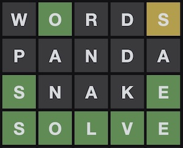
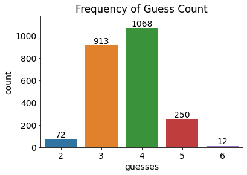
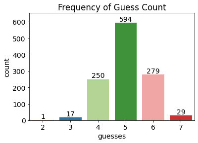

A [Wordle](https://www.powerlanguage.co.uk/wordle/) solver made with Python, pandas, and numpy.

Wordle is a game where the objective is to guess five-letter words until you find that day's solution. After each guess, you will be given feedback for each letter. 

- A green color denotes a letter found in the solution word that is also in the same position as the solution word. 
- A yellow color denotes a letter found in the solution word but is not in the same position as the solution word. 
- A black color denotes a letter that is not found at all in the solution word.

Using these clues, you can make better guesses until you either guess the solution word correctly or run out of attempts after six guesses.

The Jupyter notebooks found in the Notebooks directory contain code that implements an algorithm which optimizes for Information Gain. I select the word that in the worst case (feedback with all black letters) eliminates the most possible words. This approach is similar to how Decision Trees choose where to split.

My algorithm solves for all 2,315 words contained in Wordle's solution bank within six guesses, with a mean of 3.66 guesses.

I have provided comments in the notebooks if you wish to read about my methods and choices. The Wordle Setup notebook generates the features necessary to solve for each word, and the Wordle Solver notebook solves for each word and records the results.

## Update 2022 Feb 12

To test how easy it would be to extend my algorithm to similar games, I copied the two notebooks and adjusted the code to solve for Mastermind. Mastermind does not provide feedback for each individual position, but instead provides feedback on the whole guess. With just a few modifications, the algortihm solves for every pattern within seven guesses. 

